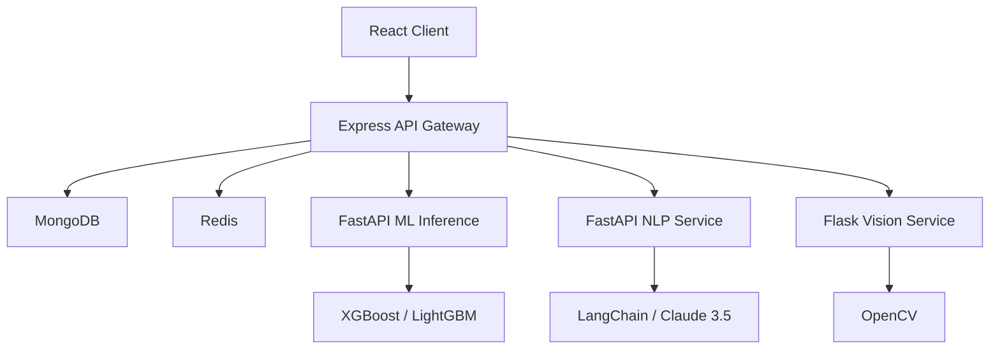

# F1 2026 Season Tracker — AI/ML/DS Pro

## Project Overview
This is an advanced Formula 1 season tracking platform enhanced for a Final Year Project at BITS Pilani. It features a microservices architecture, predictive ML models, and a RAG-powered AI assistant.

### Architecture


### Setup Instructions
1. **Clone the repository**
2. **Setup environment variables**: Copy `.env.example` to `.env` and fill in keys.
3. **Run with Docker**:
   ```bash
   docker-compose -f docker/docker-compose.yml up --build
   ```
4. **Manual Setup**:
   - Install Node deps in `server/` and `client/`
   - Install Python deps from `ml/requirements.txt`
   - Run services on ports 5000, 8001, 8003, 8004, 8005.

### Academic Context
- **Institution**: BITS Pilani, Hyderabad Campus
- **Course**: Final Year Project (2025-2026)
- **Domain**: Nuclear Physics + Computer Science Integration (Probabilistic Modeling)
