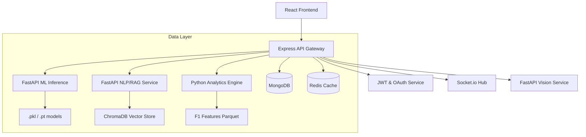

# System Architecture Document (SAD) — F1 2026 Season Tracker

## 1. Overview
The F1 2026 Season Tracker is a production-grade, microservices-based platform designed for high-performance sports analytics. It leverages modern full-stack technologies and specialized AI/ML/DS modules.

## 2. Component Architecture

## 3. Microservices Definition

| Service | Port | Primary Tech | Responsibility |
|---------|------|--------------|----------------|
| **api-gateway** | 5000 | Node.js/Express | Auth, Routing, Proxying |
| **ml-inference**| 8001 | FastAPI/PyTorch | Model serving, Predictions |
| **data-pipeline**| 8002 | Python/Pandas | Feature Engineering (ETL) |
| **nlp-service** | 8003 | FastAPI/LangChain| RAG, LLM Streaming |
| **vision-service**| 8004| FastAPI/OpenCV | Image recognition |
| **analytics-engine**| 8005| Python/SciPy | Statistical Analysis |
| **websocket-hub**| 5001 | Node.js/Socket.io| Real-time events |

## 4. Scalability & Performance
- **Asynchronous Execution**: All Python services use FastAPI for non-blocking I/O.
- **Caching**: Redis TTL-based caching for LLM responses.
- **Load Balancing**: Ready for Nginx/Kubernetes deployment via Docker.

## 5. Security
- **Admin Proxy**: All ML services are proxied through Express with `adminAuthMiddleware`.
- **JWT**: Secure token-based authentication for user sessions.
